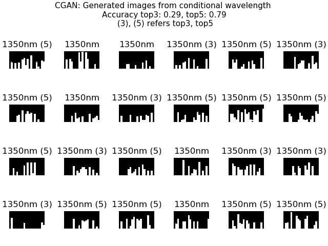

The code for Conditional Generative Adversarial Nets using Keras tensorflow.

## Project Setup
    $ pip install -r requirements.txt
    
## Usage
  
  Train:
  
    $ python cgan.py
  
  Test random wavelength:
  
    $ python cgan.py -g cgan_maxwellfdfd.h5
  
  Test specific wavelength (0 ~ 23 -> 400nm ~ 1550nm):
  
    $ python cgan.py -g cgan_example.h5 -w 19
    
## examples

    1. generated images with conditional input (max wavelength: 400nm ~ 1550nm)
    2. calculated top 3, 5 transmittance wavelength w/ prediction model. 
    3. calculated accuracy w/ the predicted top 3, 5 wavelengths. 

